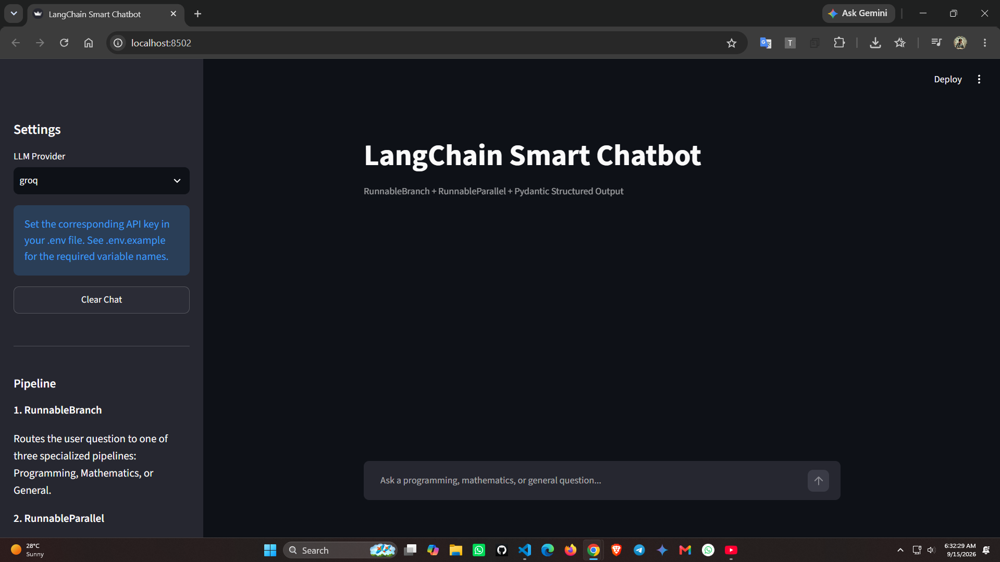
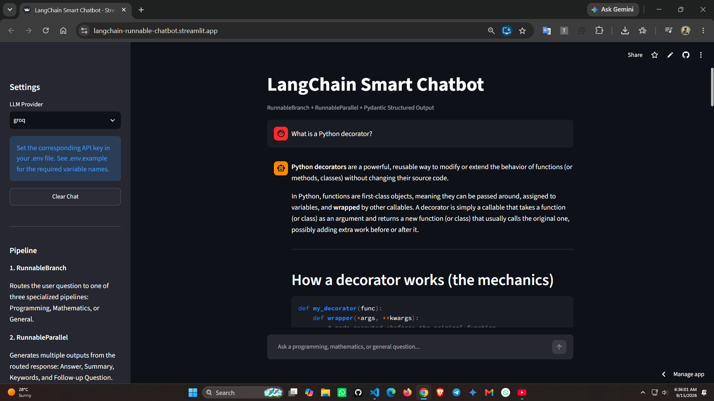

# LangChain Smart Chatbot

A modern Streamlit-based chatbot built with **LangChain Runnable APIs**, demonstrating `PromptTemplate`, `RunnableBranch`, `RunnableParallel`, and **Pydantic Structured Output**.

The application routes user questions to specialized pipelines for **Programming, Mathematics, and General** queries, generates multiple supporting outputs in parallel, and finally validates the response through a Pydantic schema.

## Live Demo

**Live Application:**
https://langchain-runnable-chatbot.streamlit.app

---

## Screenshots

### Screenshot 1



### Screenshot 2


---

## Project Overview

This project demonstrates how modern LangChain Runnable APIs can be combined to build a structured and modular chatbot application.

The chatbot follows this pipeline:

```text
User Question
      |
      v
PromptTemplate
      |
      v
RunnableBranch
      |
      +------------------+
      |                  |
      v                  v
Programming          Mathematics
      |                  |
      +--------+---------+
               |
               v
            General
               |
               v
          Main Answer
               |
               v
       RunnableParallel
        /      |       \
       /       |        \
      v        v         v
 Summary   Keywords   Follow-up
       \       |        /
        \      |       /
         +-----+------+
               |
               v
     Pydantic Structured Output
               |
               v
         Streamlit UI
```

---

## Features

* Modern LangChain Runnable architecture
* `PromptTemplate` for reusable prompts
* `RunnableBranch` for intelligent query routing
* Specialized Programming, Mathematics, and General pipelines
* `RunnableParallel` for generating multiple independent outputs
* Pydantic-based structured response validation
* Native `with_structured_output(ChatResponse)`
* Configurable LLM provider
* Groq support
* OpenAI support
* Google Gemini support
* Secure API key management using environment variables
* Streamlit chat interface
* Conversation history
* Structured output inspection
* Confidence score
* Automatic summary and keyword generation
* Follow-up question generation
* Clean modular project structure

---

## Technology Stack

| Technology     | Purpose                           |
| -------------- | --------------------------------- |
| Python         | Core programming language         |
| LangChain      | LLM application framework         |
| LangChain Core | Runnable APIs and PromptTemplates |
| Groq           | Fast LLM inference                |
| OpenAI         | Optional LLM provider             |
| Google Gemini  | Optional LLM provider             |
| Pydantic       | Structured output validation      |
| Streamlit      | Web-based chatbot interface       |
| python-dotenv  | Environment variable management   |

---

## LangChain Components

### 1. PromptTemplate

All prompts are defined inside `prompts.py`.

Examples include:

* Programming prompt
* Mathematics prompt
* General prompt
* Summary prompt
* Keywords prompt
* Follow-up prompt
* Final structuring prompt

This keeps prompts reusable and separates application logic from prompt engineering.

---

### 2. RunnableBranch

`RunnableBranch` determines which specialized pipeline should handle the user's question.

The current categories are:

```text
Programming
Mathematics
General
```

Examples:

```text
"What is a Python decorator?"
        ↓
Programming
```

```text
"Solve x² + 5x + 6 = 0"
        ↓
Mathematics
```

```text
"What is photosynthesis?"
        ↓
General
```

The routing logic is implemented in `chatbot.py`.

---

### 3. RunnableParallel

After the main answer is generated, `RunnableParallel` creates multiple independent outputs:

```text
Main Answer
     |
     +----> Summary
     |
     +----> Keywords
     |
     +----> Follow-up Question
```

These independent operations are fanned out through LangChain's Runnable architecture.

This demonstrates how multiple tasks can be executed from the same intermediate result.

---

### 4. Pydantic Structured Output

The final response is validated using the `ChatResponse` Pydantic model.

The application uses:

```python
llm.with_structured_output(ChatResponse)
```

The final response contains:

```python
{
    "answer": "...",
    "summary": "...",
    "category": "...",
    "keywords": ["...", "...", "..."],
    "confidence": 0.95,
    "follow_up_question": "..."
}
```

The Pydantic model also validates constraints such as:

* Allowed query categories
* Confidence range from `0.0` to `1.0`
* Structured keyword list
* Required response fields

This ensures that the application receives a validated structured object instead of relying only on raw text parsing.

---

## Project Structure

```text
langchain-chatbot/
│
├── app.py
│   └── Streamlit user interface
│
├── chatbot.py
│   └── Main LangChain pipeline
│
├── prompts.py
│   └── All PromptTemplate definitions
│
├── schemas.py
│   └── Pydantic ChatResponse schema
│
├── requirements.txt
│   └── Python dependencies
│
├── .env.example
│   └── Environment variable template
│
├── .gitignore
│   └── Git ignored files
│
├── screenshoot.png
│   └── Application screenshot
│
└── README.md
    └── Project documentation
```

---

## Installation

### 1. Clone the repository

```bash
git clone https://github.com/MRS028/YOUR_REPOSITORY.git
```

### 2. Navigate into the project

```bash
cd YOUR_REPOSITORY
```

### 3. Create a virtual environment

Windows:

```bash
python -m venv .venv
```

Activate it:

```bash
.venv\Scripts\activate
```

Linux/macOS:

```bash
python3 -m venv .venv
source .venv/bin/activate
```

### 4. Install dependencies

```bash
pip install -r requirements.txt
```

---

## Environment Configuration

Create a `.env` file in the project root.

### Groq

```env
LLM_PROVIDER=groq

GROQ_API_KEY=your_groq_api_key
GROQ_MODEL=openai/gpt-oss-20b
```

### OpenAI

```env
LLM_PROVIDER=openai

OPENAI_API_KEY=your_openai_api_key
OPENAI_MODEL=gpt-5-mini
```

### Google Gemini

```env
LLM_PROVIDER=gemini

GOOGLE_API_KEY=your_google_api_key
GEMINI_MODEL=your_gemini_model
```

Only configure the provider you intend to use.

**Never commit your actual `.env` file or API keys to GitHub.**

---

## Running the Application

Start the Streamlit application with:

```bash
streamlit run app.py
```

The application will normally be available at:

```text
http://localhost:8501
```

---

## Testing the Chatbot

### Programming

```text
What is the difference between a Python list and a tuple? Give a simple code example and explain when I should use each one.
```

Expected category:

```text
programming
```

### Mathematics

```text
Solve x² - 5x + 6 = 0 step by step and explain how you found the roots.
```

Expected category:

```text
mathematics
```

### General

```text
What is photosynthesis and why is it important for life on Earth?
```

Expected category:

```text
general
```

---

## Streamlit Interface

The application provides:

* Provider selection
* Chat history
* Chat input
* Generated answer
* Query category
* Confidence score
* Summary
* Keywords
* Follow-up question
* Pydantic structured output viewer
* Clear chat functionality

The structured response can be inspected directly from the UI to verify the Pydantic output.

---

## Security

API keys are never hardcoded in the source code.

Environment variables are loaded using:

```python
from dotenv import load_dotenv

load_dotenv()
```

Sensitive files should be excluded using `.gitignore`:

```gitignore
.env
.venv/
__pycache__/
*.pyc
```

For deployment, API keys should be stored using the hosting platform's secret management system rather than committed to the repository.

---

## Deployment

The application is deployed using **Streamlit Community Cloud**.

### Deployment Steps

1. Push the project to GitHub.
2. Open Streamlit Community Cloud.
3. Connect the GitHub repository.
4. Select `app.py` as the main application file.
5. Configure API keys through Streamlit Secrets.
6. Deploy the application.

### Streamlit Secrets

Example configuration:

```toml
LLM_PROVIDER = "groq"

GROQ_API_KEY = "your_groq_api_key"
GROQ_MODEL = "openai/gpt-oss-20b"
```

The deployed application is available here:

**https://langchain-runnable-chatbot.streamlit.app/**

---

## Requirements Mapping

This project was designed to satisfy the following functional requirements:

| Requirement                | Implementation                                     |
| -------------------------- | -------------------------------------------------- |
| PromptTemplate             | `prompts.py`                                       |
| Pydantic Structured Output | `schemas.py` + `with_structured_output()`          |
| RunnableBranch             | `chatbot.py`                                       |
| RunnableParallel           | `chatbot.py`                                       |
| Streamlit UI               | `app.py`                                           |
| Secure API configuration   | `.env` + environment variables                     |
| Modular structure          | Separate UI, pipeline, prompts, and schema modules |
| Documentation              | `README.md`                                        |

---

## Architecture Summary

The core implementation follows:

```text
PromptTemplate
      ↓
RunnableBranch
      ↓
Specialized Main Answer
      ↓
RunnableParallel
      ↓
Summary + Keywords + Follow-up
      ↓
Final Structuring Prompt
      ↓
with_structured_output(ChatResponse)
      ↓
Pydantic Validation
      ↓
Streamlit
```

This architecture avoids deprecated LangChain chain abstractions such as `LLMChain` and `SequentialChain` and uses the modern Runnable approach.

---

## Future Improvements

Possible future improvements include:

* LLM-based intent classification instead of keyword routing
* Conversation-aware responses
* Streaming responses
* Persistent chat history
* Retrieval-Augmented Generation (RAG)
* Vector database integration
* Document question answering
* Tool calling
* Authentication
* Multi-language support
* Evaluation and response-quality metrics

---

## Author

**MD. Rifat Sheikh**

**MERN & AI Developer**

Bangladesh

* GitHub: https://github.com/MRS028
* LinkedIn: https://linkedin.com/in/mdrifatsheikh
* Portfolio: https://mdrifatsheikh.info

---

## License

This project is created for educational and academic purposes.
